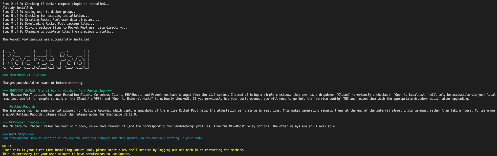
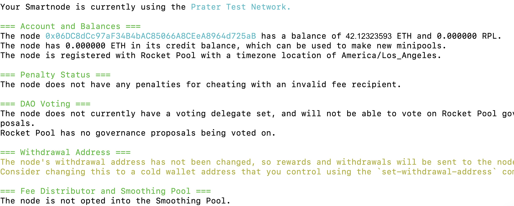
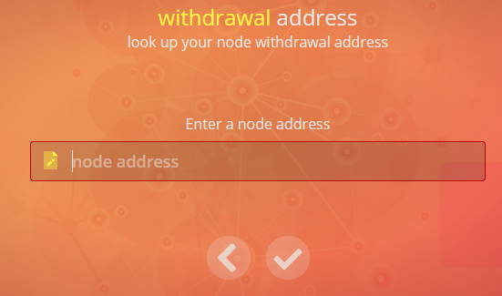
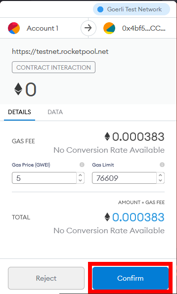
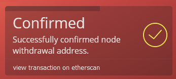
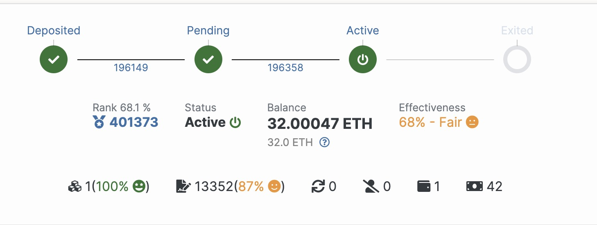

# Run a node and (optionally) stake ETH using Rocket pool, Geth, and lighthouse in codespace

## 1. Creating a Standard Rocket Pool Node with Docker
Process Overview
At a high level, here's what is involved in installing Rocket Pool:

* Download the Rocket Pool command-line interface (CLI)
* Use the CLI to install the Smartnode stack
* Configure the Smartnode stack with an easy-to-use UI in the terminal


### Step 1. Downloading the Rocket Pool CLI
Start by creating a new folder that will hold the CLI application:

```
mkdir -p ~/bin
```

Next, download the CLI. This depends on what architecture your system uses, in codespace, it's usually x86_64. 

* TIP
  * If you do not know your CPU architecture, you can run the following command to find it:
    ```
    uname -m
    ```
    The output of this command will print your architecture. Note that x86_64 is the same as x64 and amd64.Note that aarch64 is the same as arm64.

For x64 systems (most normal computers):
```
wget https://github.com/rocket-pool/smartnode-install/releases/latest/download/rocketpool-cli-linux-amd64 -O ~/bin/rocketpool
```

For arm64 systems:
```
wget https://github.com/rocket-pool/smartnode-install/releases/latest/download/rocketpool-cli-linux-arm64 -O ~/bin/rocketpool
```

Mark it as executable, so it has permissions to run:

```
chmod +x ~/bin/rocketpool
```
in here the directory where the placed the rocketpool binary is not in codespace system's PATH. so we need to set up the PATH as following step:

1. Check the Location of Your ~/bin Directory: Verify that you created the ~/bin directory in your home directory. You can do this by running the following command:
  * 
    ```
    ls ~/bin

    # this should return "rocketpool", which is list the rocketpool binary.
    ```
 
 2. Check Your PATH: Make sure that ~/bin is included in your system's PATH. You can check your current PATH by running:
  * 
      ```
      echo $PATH
      ```
    If ~/bin is not included in the PATH, you'll need to add it. You can do this by editing your shell configuration file (e.g., ~/.bashrc, ~/.bash_profile, ~/.zshrc, etc.).

  3. In codespace, we using Bash, you can edit ~/.bashrc:
  * 
    ```
    nano ~/.bashrc
    ```
  4. Add the following line to the end of the file:
* 
  ```
  export PATH=~/bin:$PATH
  ```
5. Press Ctrl+O, Enter to save the file, and Ctrl+X, Enter to exit the editor.

6. Apply Changes to Your Current Session: To apply the changes immediately to your current session, you can either restart your terminal or run the following command:
* 
  ```
  source ~/.bashrc
  ```
  This will reload your shell configuration.

7. Test the rocketpool Command: After adding ~/bin to your PATH, you should be able to run the rocketpool command without any issues. Try running:
* 
  ```
  rocketpool --version
  ```
  You should now see the version information for Rocket Pool displayed.

  > rocketpool version 1.10.2


### Step 2. Installing the Smartnode Stack

Now that you have the CLI installed, you can deploy the Smartnode stack. This will prepare your system with Docker, docker-compose, and load the Smartnode files so they're ready to go. It won't actually run anything yet; that comes later.

To deploy the Smartnode stack, you will need to run the following command on your node machine (either by logging in locally, or connecting remotely such as through SSH):

```
rocketpool service install
```
This will grab the latest version of the Smartnode stack and set it up. You should see output like this (above some release notes for the latest version which will be printed at the end):



If there aren't any error messages, then the installation was successful. By default, it will be put into the ~/.rocketpool directory inside of your user account's home folder. After this, start a new terminal for the settings to take effect.

Once this is finished, the Smartnode stack will be ready to run.


### Step 3. Configuring Docker's Storage Location

1. By default, Docker will store all of its container data on your operating system's drive. In some cases, this is not what you want. 
    > If you are fine with this default behavior, skip down to the next section.
    To do this, create a new file called /etc/docker/daemon.json as the root user:
    ```
    sudo nano /etc/docker/daemon.json
    ```
    This will be empty at first, which is fine. Add this as the contents:
    ```
    {
        "data-root": "<your external mount point>/docker"
    }
    ```
    where <your external mount point> is the directory that your other drive is mounted to. For here we use ./data folder as the place we store the data.

    Press Ctrl+O, Enter to save the file, and Ctrl+X, Enter to exit the editor.


2. Next, make the folder:
      ```
      sudo mkdir -p ./data/docker
      ```

3. Now, restart the docker daemon so it picks up on the changes:
      ```
      sudo service docker restart
      ```


## 2. Configuring the Smartnode Stack

```
rocketpool service config
```
You can follow the setup step from [here](https://docs.rocketpool.net/guides/node/config/overview.html)

note, it's better to have the checkpoints setting in the Consensus Client (ETH2). You need to input the Checkpoint Sync URL, you can google it, or you can use mine as well, this setting will make the sync faster: 

```
https://goerli.beaconstate.info/  
```

## 3. Start the Rocket pool 
```
$ rocketpool service start

Your Smartnode is currently using the Prater Test Network.

Your eth2 client is on the correct network.

Your primary execution client is fully synced.
You do not have a fallback execution client enabled.
Your consensus client is is fully synced.
```

the consensus client will take a while for sync, please be patient. 

>note the rocket pool need more peer to run, so you might need to add peers to your SSD to make it run. (codespace won't work in this step, please using VM from AWS or Azure)


## 4. Create a new wallet 

```
rocketpool wallet init
```
You will first be prompted for a password to protect your wallet's private key. Next, you will be presented the unique 24-word mnemonic for your new wallet. This is the recovery phrase for your wallet.


## 5. Preparing your Node for Operation
Once you have your wallet address, you can now transfer funds into it from your wallet. Here I was using my MetaMask wallet to make the transfer:
<br>
 

<br>


<br>

once the transfer is done, you can go the the [Rocket wallet](https://testnet.rocketpool.net/withdrawal-address) to check your fund:

<br>


Now you've successfully started the Smartnode services, created a wallet, and finished syncing both the Execution (ETH1) and Consensus (ETH2) chains on your respective clients. If so, then you are ready to register your node on the Rocket Pool network and create a minipool with an ETH2 validator

```
rocketpool node register
```
once it finished registering, you can process to the withdrawal address setting


check status by 
```
rocketpool --allow-root node status 
```
it will show something like below 



## 6. Setting your Withdrawal Address

### step 1: run
```
rocketpool node set-withdrawal-address <your cold wallet address or ENS name>
```
Your new withdrawal address will be marked as "pending". Until you confirm it, your old withdrawal address will still be used.


### step 2: Confirm withdrawal address
To confirm it, you must send a special transaction from your new withdrawal address to the minipool contract to verify that you own the withdrawal address.
The easiest way to do this is to navigate to the Rocket Pool withdrawal address site (for the Prater Testnet or for Mainnet).


### step 3: Confirm to enable the Rocket Pool website to use your wallet
If you haven't already connected Metamask or WalletConnect to the Rocket Pool website, do this now. Click the select wallet button in the center of the screen, and choose MetaMask or WalletConnect based on which wallet you would like to use. You will then be prompted asking you to confirm the connection.

### step 4: confirm the node withdrawal address
<br>


<br>
Type your node wallet address here and click on the Check Mark button to continue.

1. You will be prompted with a question asking if you want to set a new node withdrawal address or confirm a pending one. Select Confirm.
2. Now, there should be a new confirmation dialog in your wallet. Again, using MetaMask as an example, click the MetaMask icon to open it and you should see something like this:
<br>



<br>
Click Confirm to send the transaction to the network. This will take some time until it gets mined, but once it does, you will see a confirmation dialog:
<br>



<br>


## 7. Creating Minipools (Validator)

Before creating a minipool, the first step is to choose the amount of ETH you want to bond. in here we choice to bond 8 ETH. 


### Staking via the Website
In order to stake on behalf of your node an address must be whitelisted. You can do this via the following Smartnode command:


```
rocketpool node add-address-to-stake-rpl-whitelist address-or-ens
```

### staking via the Node CLI 
```
rocketpool node stake-rpl
```

here's the output

```
Please choose an amount of RPL to stake:
1: The minimum minipool stake amount for an 8-ETH minipool (100.794306 RPL)?
2: The maximum minipool stake amount for an 8-ETH minipool (503.971527 RPL)?
3: The minimum minipool stake amount for a 16-ETH minipool (67.196204 RPL)?
4: The maximum minipool stake amount for a 16-ETH minipool (1007.943054 RPL)?
5: Your entire RPL balance (3357.982300 RPL)?
6: A custom amount
```

Select how much you'd like to stake, then confirm the operation.

Once you finished you can check the status again 

```
rocketpool node status
```
you will have output as:

```
The node has a total stake of 3357.982300 RPL and an effective stake of 3257.13874 RPL.
This is currently 26.32% of its borrowed ETH and 92.39% of its bonded ETH.
It must keep at least 100.794305 RPL staked to claim RPL rewards (10% of borrowed ETH).
It can earn rewards on up to 503.971526 RPL (150% of bonded ETH).
The node has enough RPL staked to make 1 more 8-ETH minipools (or 2 more 16-ETH minipools).
```
This will show you how many minipools you can make of each bond size based on your RPL collateral.

### 8. Depositing ETH and Creating a Minipool
```
rocketpool node deposit
```

you can choice either 8 Eth or 16 Eth to deposit. 

you can check the status in https://goerli.beaconcha.in/

also you can check your dashboard for the validators status.


it will take 2 days for receive the transfer.
after you done, it should be something like this below:


